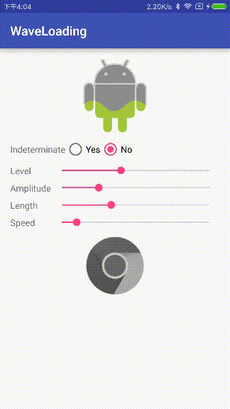

#WaveLoading

This library provides a *wave loading* animation as a **Drawable**.



## How to use

Only one line.

```
Drawable mWaveDrawable = new WaveDrawable(otherDrawable);

// Use as common drawable
imageView.setImageDrawable(mWaveDrawable);
```

Other configurable APIs:

* `public void setWaveAmplitude(int amplitude)`, set wave amplitude (in pixels)
* `public void setWaveLength(int length)`, set wave length (in pixels)
* `public void setWaveSpeed(int step)`, set wave move speed (in pixels)
* `public void setIndeterminate(boolean indeterminate)`, like progress bar, if run
in *indeterminate* mode, it'll increase water level, otherwise, you can
use `boolean setLevel(int level)` to set the loading progress.

## License
MIT
